<h1>Project One: Battleships</h1>
<h2>Project Overview</h2>

The first GA Software Engineering immersive course project was in week 4 of the course, with the brief of creating a Battleships game using JavaScript, HTML and CSS.  I learnt a lot about streamlined, readable, and reusable code, by implementing objects, functions and methods in JavaScript, as well as had some fun with HTML5 and CSS techniques. 

<h3>Deployment link:</h3>

https://james-gulland.github.io/battleships/ 

<h3>Timeframe & Working Team</h3>

This project was a solo, independent project with a duration of 1 week for completion.  I conducted the initial plan and requirements, to the wireframe, and then on to the development and testing.

<h3>Technologies Used</h3>

- JavaScript
- HTML5
- CSS
- VS Code
- Excalidraw (UX wireframing)
- Git & GitHub

<h2>Brief</h2>

We were provided a list of games to choose to develop; ranging from Minesweeper, to Frogger, to Space Invaders, to Pacman, and beyond!  I settled on choosing Battleships; as it was a firm favourite of mine growing up, and also it was rated the highest degree of complexity amongst the list of games - and I wanted the challenge!  

The overall aim was to develop a Battleships game using techniques learnt in the first 3 weeks of the bootcamp, including JavaScript, HTML5 and CSS.

We were advised to plan carefully on how to approach the brief before digging straight into coding: understanding the requirements clearly, defining the rules and the features of the game, creating a wireframe/prototype to visualise how it might come together, and writing pseudo code to articulate what functionality needs to be developed.  This was split into a MVP version and additional post-MVP functionality if we had time to complete.

Once planning had been signed off by the instructor team, we then went about coding from start to finish, and hosting on the web for all to see.  We had 6 full days to complete the work.  We worked towards the mindset of reusable, readable code that was refactored as we went along.

<h2>Planning</h2>

<b>Step 1: The Plan</b>

I devised an initial plan in a readme file, with a clear understanding in the vision/concept of the game, the rules and requirements, terminology to use (which will affect how I define the variables), MVP features and post-MVP features (nice-to-have if I have the time).

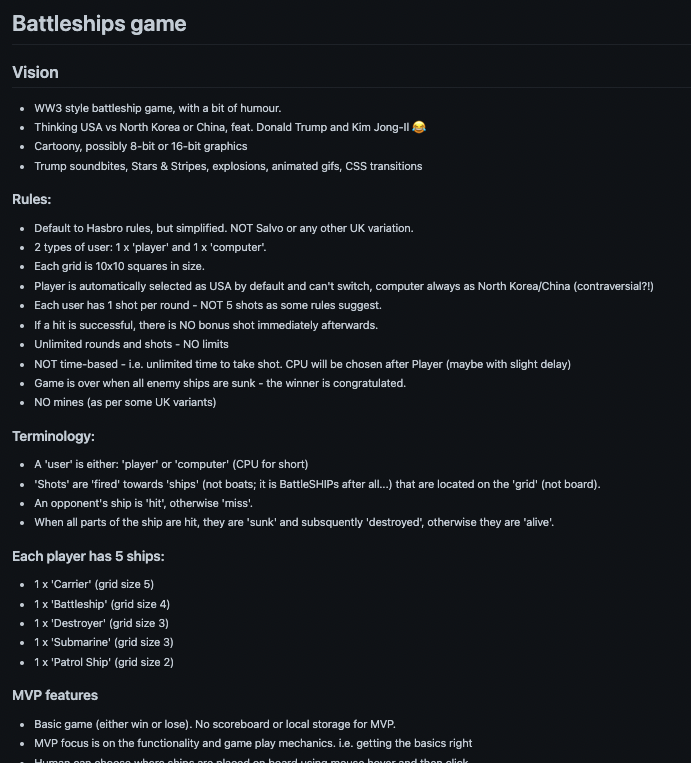

<b>Step 2: The Wireframe</b>

Creation of wireframe based on the above vision, rules, and requirements, at a high-level - which would help define the HTML structure of the page and some of the play mechanics.

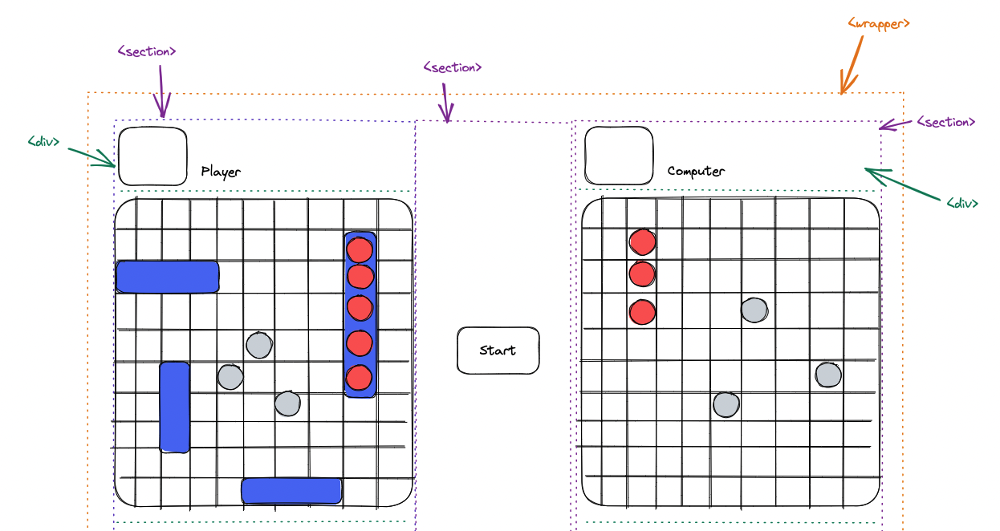

<b>Step 3: The Pseudo Code</b>

Pseudo code out all necessary elements and global variables, all the events and functions required to do the job, and the execution processes, such as page load and clicking of buttons.  

I knew this was likely to change as I started developing the game, but it was useful to map things out initially in my brain, in terms of what reusable functions I might need, how to name variables in line with the terminology defined in the planning process, and how everything was going to link together.

<h2>Build Process</h2>

<b>Step 1: Develop a mock game ‘playground’ to experiment with functionality</b>

Initially, I didn’t want to create all the HTML structure and perfect the CSS upfront; I just wanted to create a ‘playground’ area so that I could tackle the hardest problems first.  I did this by automatically generating a couple of grids using a ‘createGrid’ function; one for the player and one for the computer.  This function was a reusable component for both instances, and generated a 10x10 grid, which are the official board sizes defined by Hasbro.  I put the indexes as inner text so I could debug easily.

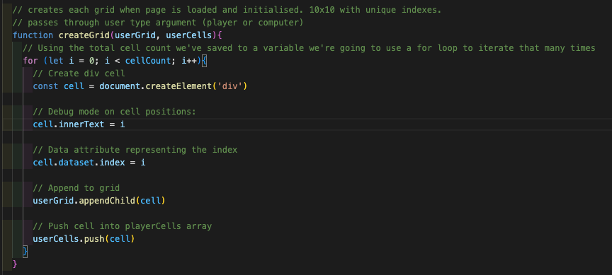

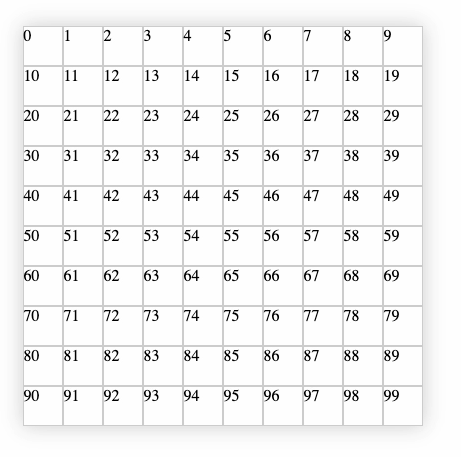

I also defined some of the key global variables and objects in order to generate the basics of the game mechanics, such as the player and computer ships objects, that could be reused throughout the codebase:

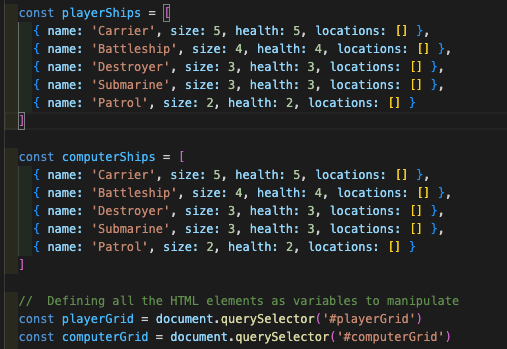

It is also worth noting at this point that I was only focusing on MVP features at this point, and putting anything related to post-MVP was on the backburner.  I know what I wanted to achieve, so I could think about it when creating the initial building blocks, but also not get bogged down by the wealth of things I needed to do at this point, and to not be too hard on myself.

<b>Step 2: Tackle the hardest / biggest unknowns first.</b>

Once I had a ‘playground’ set up, I then wanted to tackle the hardest components during the initialisation of the game - which is: a) to validate ships positions correctly on the board, with no overlap or invalid entries that span outside of the grid, and b) to automatically generate the computer selections and place on the board accordingly.

I would say most of the difficult logic of the game was condensed into these 2 areas, so I tackled this work first, leaving some breathing room for the rest of the application later on.  I did a lot of development and testing on this playground grid, as per below:

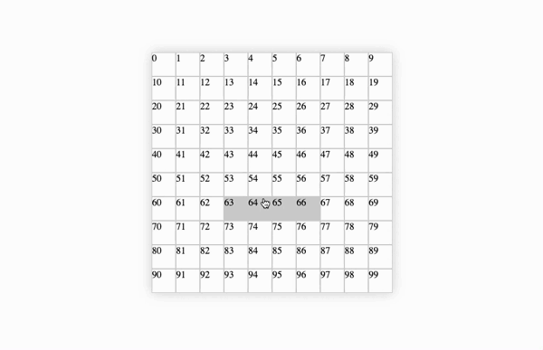

As you can see this caters for both horizontal and vertical positioning (which is controlled by using the keyboard arrow keys) and then identifying whether the place is on the grid or not, and placing a class on the cells which are valid, which is picked up by the CSS properties defined by being a ‘validPosition’.

Once I had this working, I then added further validation on pieces that had been set or deployed on the grid, so you can’t overlap those pieces, and then work on generating the logic to automatically add computer selections using the same logic, as you can see in the below gif.  The harder grey colour denotes that both positions are valid with the grid, and is not assigned to a previously validated cell.  The below example is just reloading the page to generate random computer positions on the grid.

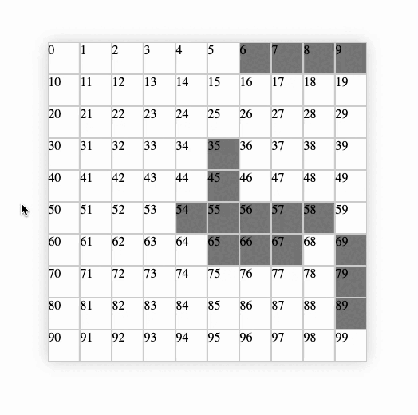

<b>Step 3: Adding core functionality for firing and scoring</b>

Once the hard bits were out of the way, I then moved onto the firing and the scoring mechanics.  This was relatively straightforward compared to what I did previously.  I had a ‘fireShot’ function that took in arguments for either player or computer and the associated cells, and then returned an outcome, as you can see below:

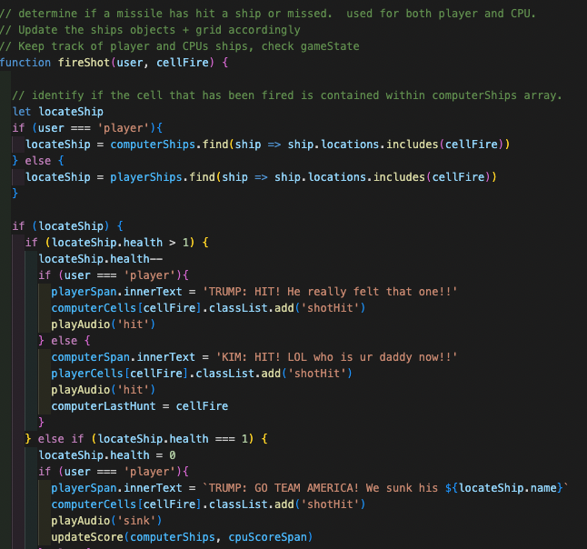

I really enjoyed creating reusable code that worked for both player and computer moves, such as updating the scores of ship emojis on the page, using JS methods such as filter and repeat to optimise the workflow:

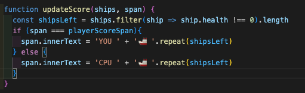
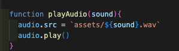

<b>Step 4: Wrapping up MVP: creating an end-to-end experience, including UI</b>

At this point, I pretty much had the ‘middle’ of the game mechanics sorted, and now I just needed to construct the beginning and the end states of the game, along with introducing a more player friendly UI.  This came together a lot quicker than I had expected; the CSS taking no longer than 3 hours of tinkering.

I really enjoyed adding some cool CSS animations (the background sea image moved like waves) and the buttons all had clickable animations.  All the hit states were manipulated via CSS, changing the border radius of the cells produced a simple but effective solution to showing hits vs misses.

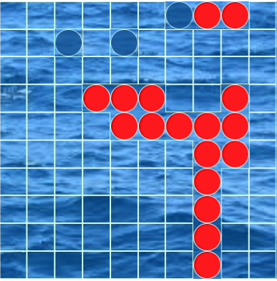
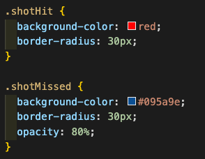

As you can see, the CSS was very simple and effective to implement.  Setting a border-radius of 30px enabled rounded cells once a shot was hit or missed, and I added some opacity to the missed shots so you could still see the water beyond.

<b>Step 5: Adding post-MVP features</b>

After sorting the basic MVP, and outside of the original scope of the project, I then decided to work on adding a couple of post-MVP features: resetting the game, and adding intelligence to the computer turns so rather than random, they worked on the previous hit and then guessed around that.  The former was relatively simple to add (re-using the Start button mechanics but resetting all the global variables and states).

Adding ‘intelligent’ computer play, however, was a LOT more difficult! I thought it might have been an easy task, but it was far from it. I had to research some stuff on the web on how to approach this, as there are various degrees of complexity.

After a while, I managed to get some basic ‘intelligence’ implemented as per below (see top-right) where the computer ‘hunts’ down the players ship based on previous hits.

The complexity is fairly basic, relatively, compared to some solutions offered on the internet!  But it works fairly well, and not too trivial:

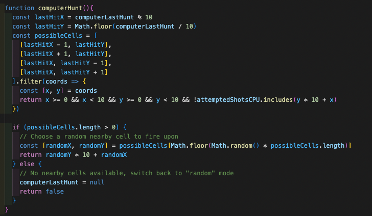

<b>Step 6: Tidying up, testing and getting it demo-ready</b>

When I was happy with the MVP and post-MVP features, I then focused on NOT adding any new features, but instead refactoring and polishing what I had already.  And that meant a LOT of testing, ironing out bugs and improving general UX.  I also decided to add some audio samples to make it more fun, which was a small but more time consuming task than I initially thought!  I also removed any debug modes and unnecessary console logs from the code for production ready code.  Then it was good to go!  

Had a LOT of fun with this, and I expect to build upon it, and improve it, post the course.

